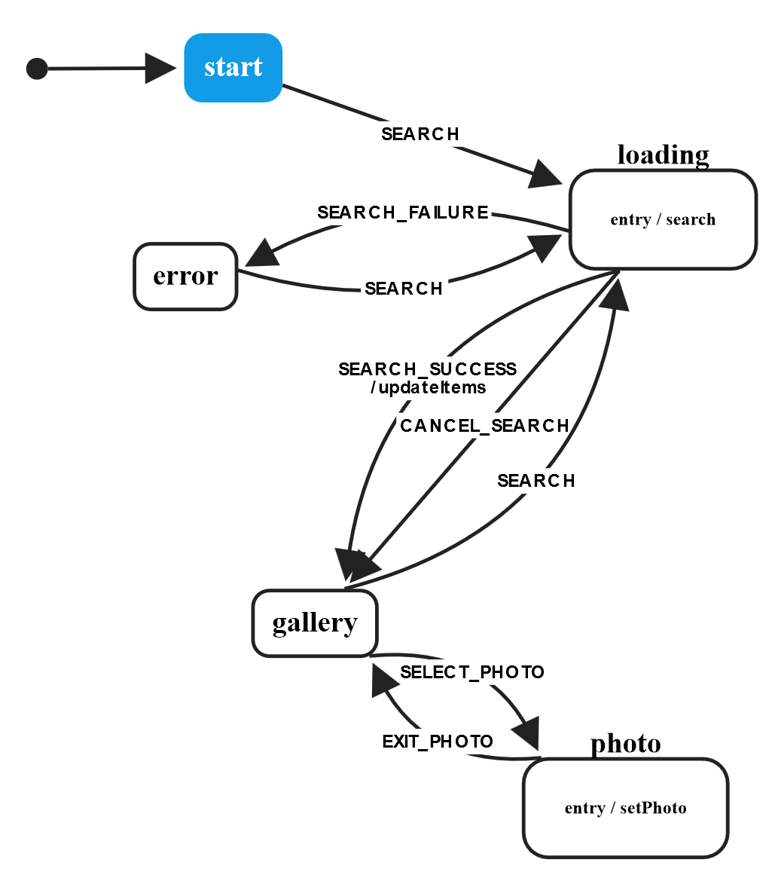

import { Appear } from 'mdx-deck'
import { FullScreenCode } from 'mdx-deck/layouts'

import { theme } from 'mdx-deck/themes'

---
## Application State for Designers

---

## Me

@carlhedgren
 - high quality algebraic compositional programming memeposting
 - also programmer kvetchposting
 - clicky web-stuff

```notes
I'm from sweden
Actually a real engineer, with steel and stuf.
I like plants and math and welding

```
---
## My Agenda

- We should think more about state
- And state transistions

<span> Wouldn't it be nice with less state tho? 🏴</span>

---

# So what is application state?

-it's all the the things that influence what you see on the screen!

- checkboxes
- buttons
- dynamic content!
- ajax requests
- screen size
- Orientation
- The url

---

## Why should we care?

All UIs are* state machines (can be modelled as)

- A state machine is a piece of value and a transition function
that describes how to go from that first value to the next value given some particular action


```notes
an fsm is actually five things:
1. initial state
2. a set of states
3. a set of actions
4. a transistion function
5. a final state, perhaps

technically, we want Mealy machines

but that will just cloud the waters here.

Think of it as States and ways of going between states.

This is just a model. There are bunches of other ways
of thinking about this.

```

---
Imagine a search box, how do we use that?

<ul>
  <Appear>
    <li>Initial render, just a search box and a button</li>
    <li>Entered search term</li>
    <li>Loading</li>
    <li>Display Search Results</li>
  </Appear>
</ul>

```notes
What's missing here? - The transitions, how do we get from state to
state? Click the input, click the button, do the fetch.. etc
```

---

## Do we design for this?

Sometimes we illustrate the tab order


```notes
this taborder is wrong tho
```

---

Other times we illustrate the User flow


```notes
 but this is only ever explicit about the transistion and why they happen
 we are talking about transitions but not state

```
---

## Do we code for this?

Mostly incidentally!
Seldom explicitly and in some ways, developers think less
about this than designers

```js

			//Search field on small devices
			$(".searchExamCode").click(function(e) {
				e.preventDefault();
				$(".filterMobile .searchInDatasetContainer").addClass("is-visible");
			});

```

```notes
  This example has a state ".is-visible"
  and a transisiton, the anonymous functions in the clickhandler

  In other words, we are talking about both state and transitions but only
  because we have to. There is not a lot of plan or structure about how and why.

  "if this gets clicked, it should have the is-visible class" is pretty much the extent
  of the thinking here.

  That said, some libraries and programming models are more explicit about these things than others

```

---

## Does it matter?

Well, yes.

```notes
it is about how we think about delivering product
it is about how we work, integratedly
it is about ad-hoc discovery of how to do things .v
being principled in our modelling

```

---

How about this one

 <div>
     <style dangerouslySetInnerHTML={{__html: `
    .container {
        display: grid;
        grid: repeat(3, 12vw) / auto-flow;
        margin-top: 20px;
        }
   .red {
        display: inline-block;
        width: 100px;
        height: 100px;
        background: #eaeaea;
    }
    .search {
        margin: 0 20px;
    }
    `}} />
     <h3>A picture gallery</h3>
     <div className="search">
    <input type="search"/><button>Search</button>
    </div>
    <div className="container">
        <span className="red"/>
        <span className="red"/>
        <span className="red"/>
        <span className="red"/>
        <span className="red"/>
    </div>
 </div>

---

<Appear>
<p>What if the user clicks the search button repeatedly? </p>
<p>What if the user wants to cancel the search while it's in-flight?</p>
<p>Is the search button disabled while searching?</p>
<p>Is there any indication that the results are loading? </p>
<p>What happens if there's an error? Can the user retry the search? </p>
<p>What if the user searches and then clicks a photo? What should happen? </p>
</Appear>

---

"Show me five projects and I'll show you ten different ways of
doing that"

---

## The Ivory tower provides

David Harel - Statecharts: a visual formalism for complex systems (1987)


## And taketh away

Martin Kot - The State explosion problem  (2003)

---

So what could this look like?



---

A live demo?

<Appear>
  <a href="https://musing-rosalind-2ce8e7.netlify.com/?machine=%7B%22initial%22%3A%22start%22%2C%22states%22%3A%7B%22start%22%3A%7B%22on%22%3A%7B%22SEARCH%22%3A%7B%22loading%22%3A%7B%7D%7D%7D%7D%2C%22loading%22%3A%7B%22onEntry%22%3A%5B%22search%22%5D%2C%22on%22%3A%7B%22SEARCH_SUCCESS%22%3A%7B%22gallery%22%3A%7B%22actions%22%3A%5B%22updateItems%22%5D%7D%7D%2C%22SEARCH_FAILURE%22%3A%22error%22%2C%22CANCEL_SEARCH%22%3A%22gallery%22%7D%7D%2C%22error%22%3A%7B%22on%22%3A%7B%22SEARCH%22%3A%22loading%22%2C%22QUIT%22%3A%22end%22%7D%7D%2C%22end%22%3A%7B%7D%2C%22gallery%22%3A%7B%22on%22%3A%7B%22SEARCH%22%3A%22loading%22%2C%22SELECT_PHOTO%22%3A%22photo%22%7D%7D%2C%22photo%22%3A%7B%22onEntry%22%3A%5B%22setPhoto%22%5D%2C%22on%22%3A%7B%22EXIT_PHOTO%22%3A%22gallery%22%7D%7D%7D%7D" target="_blank">PERHAPS!</a>
</Appear>

---

I think that's pretty cool

---
something slightly different:

"How X Slays a UI Antipattern"


```notes

these kinds of articles deals with one of my pet peeves.

What does it mean to load data?

When are we done? What do we display?

```
---

A flash of unstyled content!


real numbers are 3 comments, ~500 retweets and about 1k likes

```notes
why does this happen?

```

---
We have this

```js
{
    isLoading: true,
    data: 0
}
```

```notes
this is the enemy.

Should we display the spinner?

```

---

what about now?

```js
{
    isLoading: false,
    data: 5
}
```

```notes

Should we display the spinner?

```

---

now?

```jsx
{
    isLoading: true,
    data: 5
}
```

```notes

it really depends!
```

---

now what?

```js
{
    isLoading: false,
    data: 0
}
```

```notes

Should we display the spinner?

We can't know! It depends

```

---

An alternative from the folklore
```
 type Fetch result error = NotAsked
                         | Loading
                         | Failed error
                         | Success result


```

```notes

this is of course a lie! Javascript can't really do that.
and that is really unfortunate!

```
---

The folklore is also a lie!

```
 type Fetch result error = NotAsked
                         | Loading
                         | Failed error
                         | Refreshing result <- THIS ONE?
                         | Success result


```
<Appear>
Infinite scrolling anyone?
</Appear>

```notes

And there's more! What if you implement "infiintie scrolling"
```

---

Closing words

State and Transisitons in UI are intertwined and
hard to separate. I believe that in order to build
nice UX we must think of the transitions but in order
to create business value, we must ponder the state.
